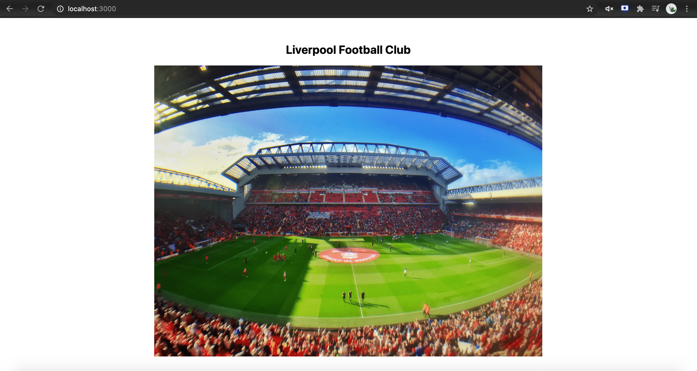
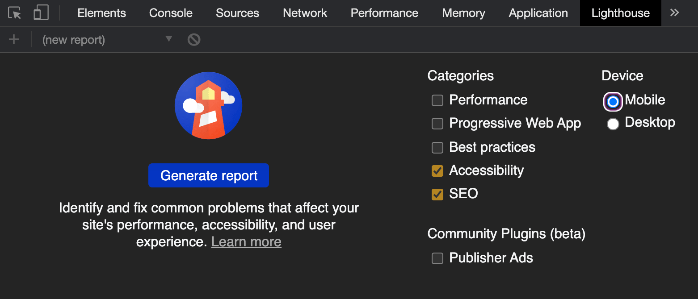
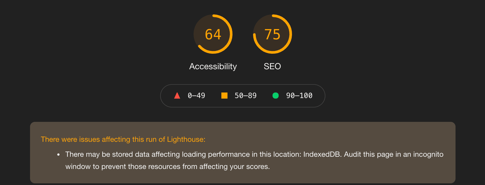
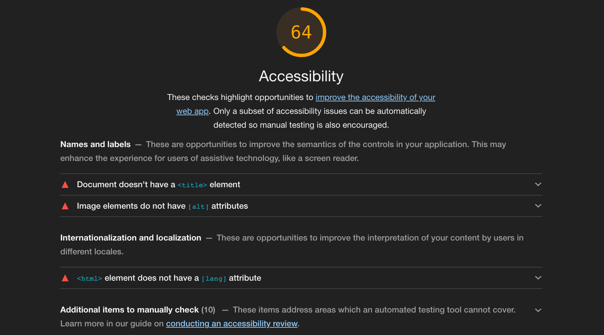
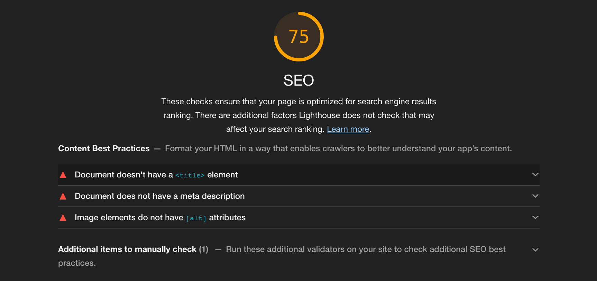

Today, we have a fairly simple task of optimizing the SEO of an even fairly simple Next.js app. We will produce reports from lighthouse before and after the optimizations to make sure we understand the optimizations in each step of the way.



The application is only a couple lines of code with an h2 and an image tag. The crux of this tutorial is not to try anything complex but to optimize the SEO of a simple yet purposeful application. By the end of this tutorial, we will clearly understand the necessary steps that we need to take along the way to improve SEO and accessibility.

## Reports from Lighthouse (Before optimization)

If you don't already know where to find the lighthouse interface, I have attached a little image that can help you find it to get started with lighthouse.



Make sure you check the SEO and Accessibility options since we are only dealing with SEO in this tutorial. Make sure you uncheck any other options. Hit the Generate report button to see where your SEO ranks.



I have already done that for myself, and as you can see the Accessibility and SEO of our app is average. Not too good and not too bad. But let us try to improve further and see how well we do.

## Additional Report Information

Also when lighthouse generates a report, it also provides you with additional information like below to let you know what might be going wrong or what isn't included. This essentially provides you with enough information for you to know where you need to work on to skyrocket the SEO.

### Accessibility Scores

- Missing `title` tags.
- Image element doesn't have an `alt` tag.
- html element doesn't have a `lang` attribute.



### SEO Scores

- Missing `title` tags.
- Document doesn't have a meta description.
- Image element doesn't have an `alt` tag.



# Step towards optimization

We have a simple `index.js` file you could ever imagine. We haven't done any neat optimizations yet.

```js
export default function Home() {
  return (
    <div className={styles.container}>
      <h2>Liverpool Football Club </h2>
      <Image src='/anfield.jpg' width='800' height='600' />
    </div>
  );
}
```

The very first optimization that I can see right off the bat is to use semantic markup to reinforce structural meaning of the content of a webpage. Semantically correct HTML helps search engines serve your page better. And also let us add an alt in our Image tag (this is mainly helpful for screen readers).

```javascript {3,4}
export default function Home() {
  return (
    <main className={styles.container}>
      <h1>Liverpool Football Club </h1>
      <Image
        src='/anfield.jpg'
        alt='Liverpool Football Club Stadium'
        width='800'
        height='600'
      />
    </main>
  );
}
```

A very good article on why an "alt" text still matters for SEO can be found here [@Directom.](https://www.directom.com/image-seo-using-alt-text/#:~:text=The%20Importance%20of%20Alt%20Text%20Content%20for%20Image%20SEO&text=When%20you%20use%20an%20optimized,your%20page%20is%20all%20about.)

## Adding a title element on our page

This is still our `index.js` file and notice we need to insert the title tag right within a head tag. But we don't have a body tag and typical HTML tags in Next.js since all of those are handled by the framework itself.

```js
export default function Home() {
  return (
    <main className={styles.container}>
      <h1>Liverpool Football Club </h1>
      <Image
        src='/anfield.jpg'
        alt='Liverpool Football Club Stadium'
        width='800'
        height='600'
      />
    </main>
  );
}
```

But to overwrite those tags there's certainly a work-around. The way we can achieve this in Next is to import a package like so.

```js {1,6-8}
import Head from 'next/head';

export default function Home() {
  return (
    <main className={styles.container}>
      <Head>
        <title>Liverpool Football Club</title>
      </Head>

      <h1>Liverpool Football Club </h1>
      <Image
        src='/anfield.jpg'
        alt='Liverpool Football Club Stadium'
        width='800'
        height='600'
      />
    </main>
  );
}
```

Now anything that we want to put inside the head tag will go here. I have put on the title tag.

## SEO specific tags

To cogently understand SEO meta tags I would highly recommend you to take a look at an article from [Moz-The ultimate guide to SEO meta tags.](https://moz.com/blog/the-ultimate-guide-to-seo-meta-tags)

Meta tags are essentially tags that provide data about your page to search engines and website visitors. In short, they make it easier for search engines to determine what your content is about and thus is a vital component for SEO.

```js {5-6}
export default function Home() {
  return (
    <main className={styles.container}>
      <Head>
        <meta httpEquiv='Content-Type' content='text/html; charset=utf-8' />
        <meta name='viewport' content='width=device-width, initial-scale=1' />
        <meta name='description' content='Liverpool Football Club Stadium' />
        <title>Liverpool Football Club</title>
      </Head>
      ...
    </main>
  );
}
```

We have bumped up a couple of meta tags (highlighted lines) that will help us with the SEO further.

- The description meta-tag essentially tells search engines, what is the page all about. And by doing this we already have a good looking SEO optimization underway.

- The viewport meta tag will help with mobile screen size optimizations and you may run the risk of poor mobile experience if you don't wish to include them.

By any chance if you want to learn more about configuring viewport you may visit the link [here.](https://web.dev/responsive-web-design-basics/)

## Adding the lang attribute to HTML

To be able to add things globally we have a file called `_document.jsx` in Next.js. Any styles or tags that you wish to flow globally should be inside this file.

- A custom Document is commonly used to augment your application's `<html>` and `<body>` tags. This is necessary because Next.js pages skip the definition of the surrounding document's markup.

To override the default Document, create the file ./pages/\_document.js and extend the Document class as shown below:

```javascript {4}
class MyDocument extends Document {
  render() {
    return (
      <Html lang='en'>
        <Head>
          <meta httpEquiv='Content-Type' content='text/html; charset=utf-8' />
          <meta name='viewport' content='width=device-width, initial-scale=1' />
        </Head>
        <body>
          <Main />
          <NextScript />
        </body>
      </Html>
    );
  }
}
```

What we have here is an HTML document with a few tags. We can move away from any sort of meta tags that needs to be used globally. As we do it here, we move the viewport and charset meta tags from the index file and move it here so every page in the application can have these attribute tags internally.

And the final thing is to add the lang attribute to the HTML tag that perdurably sits globally.

### Lines removed from index.js file

The following lines are removed from index.js (marked by x). 

```diff
x <meta httpEquiv="Content-Type" content="text/html; charset=utf-8" />
x <meta name="viewport" content="width=device-width, initial-scale=1" />
```

```javascript
<Head>
  <title>Liverpool Football Club</title>
  <meta name='description' content='Liverpool Football Club Stadium' />
</Head>
```

## Final Reports from Lighthouse

Voila! There we have our final report from Lighthouse. The nitty-gritty optimizations were certainly handy and the SEO and Accessibility ranks were bumped up to a maximum of 100.


By utilizing these simple SEO practices, we can immensely improve the visibility of our website to help the site gain better ranks and position on the search engine results page(SERP).

## Tutorial Assets

The Github link to the project repository can be found [here.](https://github.com/Boro23-wq/SEO-optimization-in-Next.js)

### Or to get started:

- git clone https://github.com/Boro23-wq/SEO-optimization-in-Next.js.git
- cd SEO-optimization-in-Next.js
- npm install
- npm run dev (to run the server)
